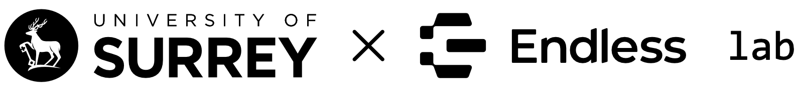
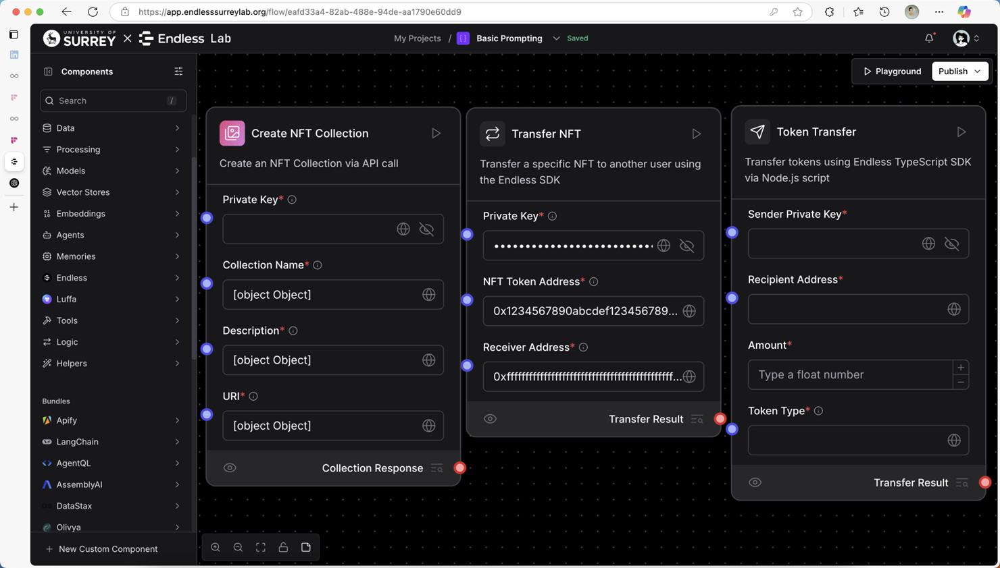
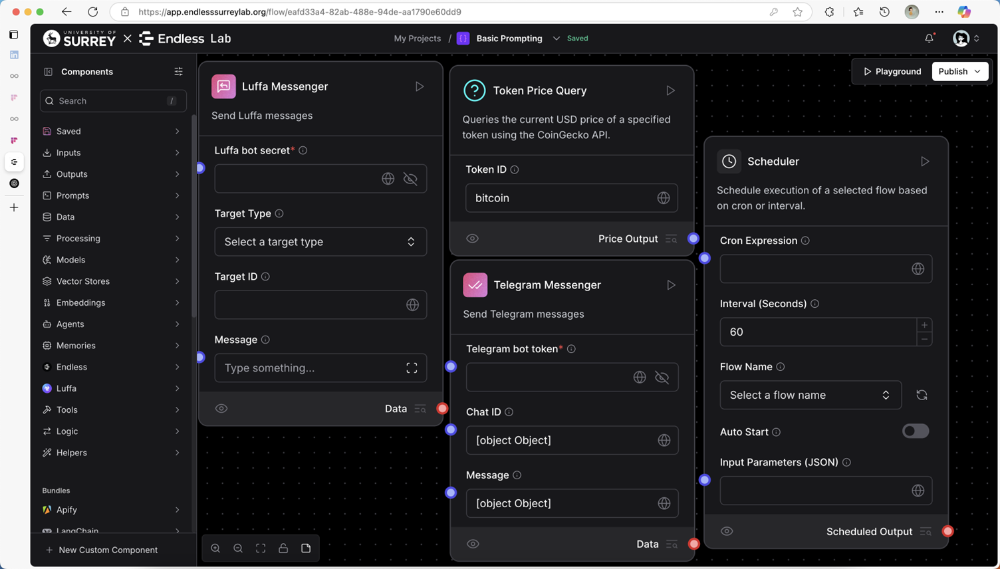

<!-- markdownlint-disable MD030 -->

---

## 📌 简要介绍 | Introduction

Surrey x Endless Lab 旨在为处于 Endless 生态下的开发者提供一个低代码的工作流创作空间。我们在 Lab 中集成了专为 Endless 区块链与 Luffa 聊天机器人设计的组件与 AI Agent，帮助用户快速搭建创意十足的工作流。

**Surrey x Endless Lab** provides a low-code workflow creation environment tailored for developers in the Endless ecosystem. It integrates custom components designed for the Endless blockchain and the Luffa chatbot, as well as AI agents to help users rapidly build creative and functional workflows.

---

## ⚙️ 核心功能 | Key Features

Surrey x Endless Lab 基于开源工作流平台 [Langflow](https://github.com/logspace-ai/langflow) 打造，在保留 Langflow 所有基础功能的前提下，增强了与 Endless 平台和 Luffa 聊天应用的深度交互。

Built on the open-source platform **Langflow**, Surrey x Endless Lab retains all the core features of Langflow while adding unique integrations with the Endless platform and Luffa chatbot ecosystem.

**主要功能包括 | Key features include:**

1. 🧩 **可视化工作流搭建**：组件拖拽与连接，数分钟内即可构建完整流程。
   *Visual workflow builder with drag-and-drop interface to create workflows in minutes.*

2. 💻 **基于 Python 的组件开发**：支持自定义与微调已有组件。
   *Python-based component customization for personalized functionality.*

3. 🧪 **内置对话测试环境**：即时测试与调试组件功能。
   *Built-in dialogue testing environment for faster debugging.*

4. 🔗 **支持 Endless 链操作**：可执行 NFT 与 Token 的读取、转移等操作。
   *Deep integration with Endless chain: supports NFT and token operations.*

5. 🤖 **集成 Luffa Messenger 组件**：与 Luffa 聊天应用程序无缝协作。
   *Native support for Luffa Messenger components to enable chatbot integration.*

---

## 🚀 开始使用 | Getting Started

当前 Surrey x Endless Lab 正由 Surrey Academy for Blockchain and Metaverse Applications 实验室托管，访问地址如下：

> [🌐 app.endlesssurreylab.org](https://app.endlesssurreylab.org)

The current version of Surrey x Endless Lab is hosted by the Surrey Academy for Blockchain and Metaverse Applications. You can try it at the address above.

**使用步骤 | Steps to get started:**

1. 登录时需授权您的 **Endless 钱包**。
   *Sign in using your **Endless wallet** for authorization.*

2. 登录后即可访问并使用 Lab 中已有的工作流。
   *After logging in, you can explore available workflows in the Lab.*

3. 您可使用左下角菜单 **自定义组件** 来构建自己的组件。
   *Use the bottom-left menu to **create custom components** for your workflows.*

---

## 📈 开发规划 | Development Roadmap

1. 当前部分 API 功能仍在测试与调试中。
   *Some API functionalities are still under testing.*

2. 将持续引入更多与 Endless 链交互的高级组件。
   *New components for deeper Endless chain integration will be added.*

3. 即将上线多个具有代表性的模板供用户参考使用。
   *Several representative workflow templates will be published soon.*

---

## 🖼️ 部分功能截图 | Feature Previews

## 🙏 致谢 | Acknowledgements
本项目基于开源项目 Langflow 进行开发与扩展，特此感谢其原始作者及社区对开源生态的贡献。Langflow 是一个由 Logspace 开发并在 MIT 许可下发布的可视化 LLM 工作流构建工具，提供了丰富的组件化架构与高度可扩展的框架，为本项目的实现提供了重要基础。

我们在使用过程中遵循了其开源协议，并在此向 Langflow 社区致以诚挚的感谢。

This project is developed and extended based on the open-source project Langflow. We would like to express our sincere appreciation to its original creators and the community for their valuable contributions to the open-source ecosystem. Langflow, developed by Logspace and released under the MIT License, is a visual LLM workflow builder offering a modular architecture and extensible framework, which served as a solid foundation for this work.

We adhere to the terms of its open-source license and extend our gratitude to the Langflow community.
